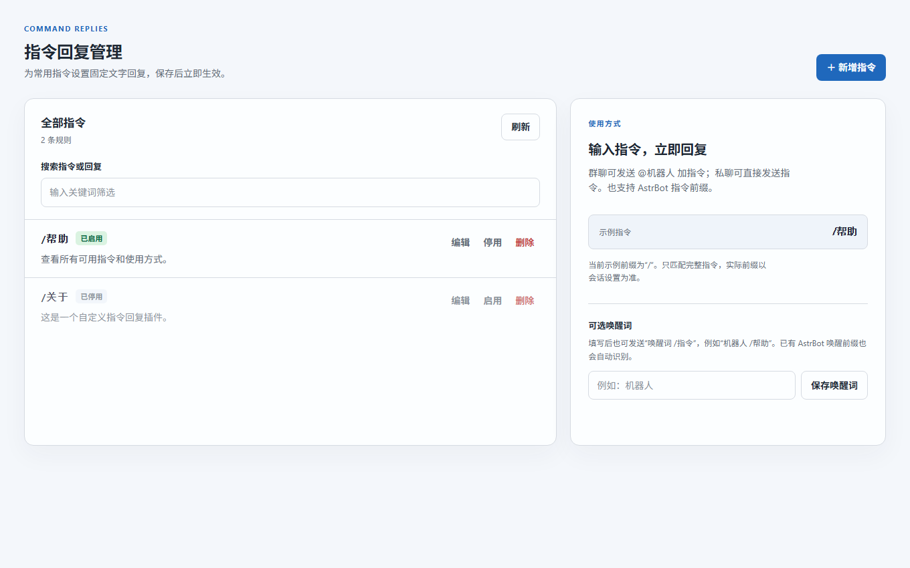

# 自定义指令文字回复

在 AstrBot 插件详情中打开独立的“指令管理”页面，逐条设置指令名称与回复文字。群聊、私聊均可使用；指令名称必须完全一致。

## 界面预览

以下为示例规则的页面预览：

## 安装

需要 AstrBot 4.26.0 或更新版本。从 [GitHub Releases](https://github.com/taolicx/astrbot_plugin_custom_command_reply/releases) 下载 `astrbot_plugin_custom_command_reply.zip`，在 AstrBot WebUI 的插件页面选择“上传插件”。安装后打开本插件详情页，进入“指令管理”。

## 配置

1. 在“指令管理”页点击“新增指令”。
2. “指令名称”填写 `帮助`，不要填写 `/`。
3. “回复文字”填写 `这是帮助内容。`，点击“保存指令”。
4. 列表中可编辑、停用、启用或删除规则。保存后立即生效。

原有插件配置表单也保留了规则列表，可以作为备用入口。独立页面与配置表单使用同一份规则。

填写“帮助”后，以下消息都会回复 `这是帮助内容。`：

- 群聊：`@机器人 帮助` 或 `@机器人 /帮助`（需要真正 @ 到机器人）
- 私聊：`帮助` 或 `/帮助`
- 群聊或私聊：`/帮助`（默认 AstrBot 指令前缀）
- 在本插件管理页把可选唤醒词设为“机器人”后：`机器人 /帮助`

若 AstrBot 修改了唤醒前缀，插件会读取当前会话所用的前缀；例如 AstrBot 将“机器人”设为唤醒前缀时，`机器人 /帮助` 也可触发。

群聊未 @ 机器人时，单发 `帮助` 不会触发。`/帮助 其他内容` 不会触发。同名规则按列表中第一条生效。为了避免与内置或其他插件指令冲突，请使用独立名称。

本版只发送固定文字，不支持图片、语音、随机内容或指令参数。
